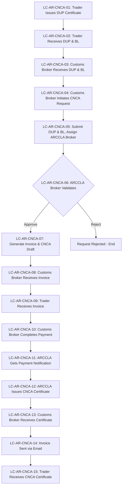
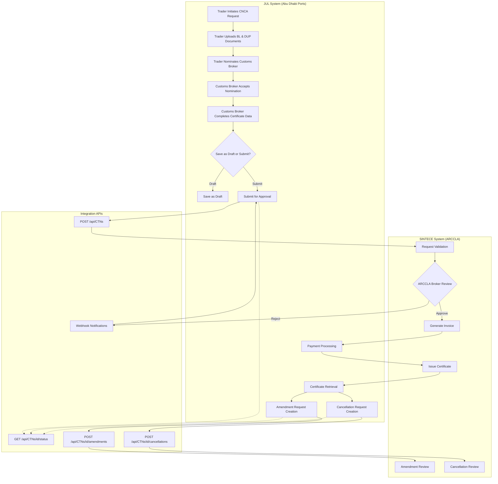
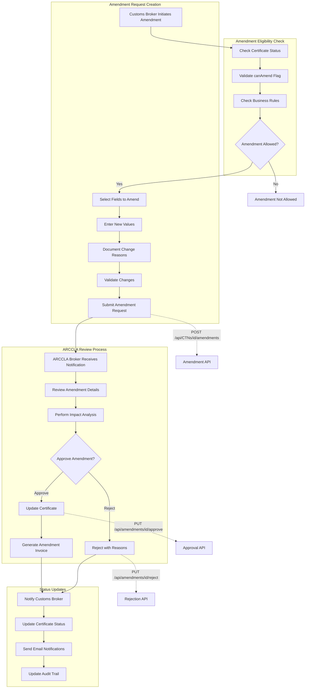
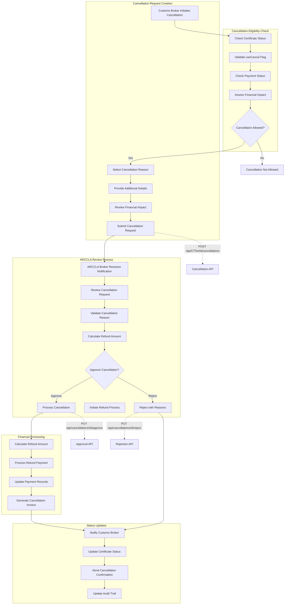
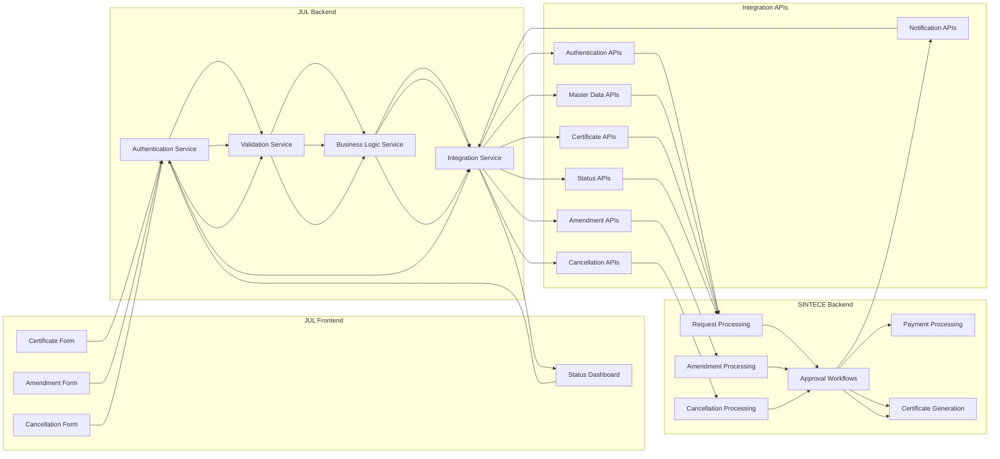

# Enhanced Process Flow Diagrams and Recommendations

## JUL-SINTECE Integration with Amendment and Cancellation Capabilities

### Overview

This document provides enhanced process flow diagrams and implementation recommendations for the JUL-SINTECE integration, incorporating advanced amendment and cancellation workflows based on the analysis of existing SINTECE processes and identified improvement opportunities.

---

## Current State Process Flow (As-Is SINTECE)

### 15-Step Traditional SINTECE Workflow

### Issues with Current Process
- Multiple manual handoffs causing delays
- Email-based communication prone to delays
- Limited visibility for traders
- No amendment or cancellation capabilities
- Manual payment reconciliation
- Duplicate data entry requirements

---

## Enhanced Future State Process Flow (To-Be JUL-SINTECE Integration)

### Core Certificate Workflow with Enhanced Capabilities

### Benefits of Enhanced Process
- Fully digital workflow with no physical documents
- Real-time status visibility for all parties
- Integrated amendment and cancellation capabilities
- Automated payment processing
- Single data entry point
- Complete audit trail

---

## Enhanced Amendment Workflow

### Amendment Request Process with ARCCLA Approval

### Amendment Eligibility Rules
- Certificate status must be "Submitted", "Approved", or "Issued"
- No pending amendments or cancellations
- Certificate not yet used for customs clearance
- Amendment requested within allowed timeframe
- User has appropriate permissions

---

## Enhanced Cancellation Workflow

### Cancellation Request Process with Financial Impact

### Cancellation Eligibility Rules
- Certificate status allows cancellation (not yet issued or used)
- Payment status allows refund processing
- Cancellation requested within allowed timeframe
- No active amendments in progress
- User has appropriate permissions
- Valid business reason for cancellation

---

## Integration API Flow Diagram

### Comprehensive API Integration Architecture

---

## Implementation Recommendations

### 1. Phase-Based Implementation Approach

**Phase 1: Core Integration (Months 1-3)**
- Basic certificate submission and approval workflow
- Master data synchronization
- Authentication and authorization
- Core validation framework

**Phase 2: Enhanced Features (Months 4-6)**
- Amendment request creation and approval workflow
- Cancellation request creation and approval workflow
- Enhanced status management with eligibility flags
- Advanced validation and error handling

**Phase 3: Advanced Capabilities (Months 7-9)**
- Real-time notifications and webhooks
- Advanced reporting and analytics
- Performance optimization
- Enhanced security features

### 2. Data Migration Strategy

**Master Data Migration:**
- Countries, ports, cargo types, and reference data
- User accounts and role assignments
- Historical certificate data (read-only)

**Gradual Rollout:**
- Start with new certificates only
- Gradually enable amendment/cancellation for existing certificates
- Maintain parallel systems during transition period

### 3. Security Enhancements

**Authentication Improvements:**
- Multi-factor authentication for ARCCLA brokers
- Role-based access control with fine-grained permissions
- Session management with automatic timeout

**Data Protection:**
- End-to-end encryption for sensitive data
- Audit logging for all amendment/cancellation activities
- Data anonymization for reporting purposes

### 4. Performance Optimizations

**Database Optimizations:**
- Indexing strategy for amendment/cancellation queries
- Partitioning for large audit tables
- Caching strategy for master data

**API Performance:**
- Response caching for static data
- Pagination for large result sets
- Asynchronous processing for heavy operations

### 5. Monitoring and Alerting

**System Health Monitoring:**
- API response time monitoring
- Error rate tracking
- System availability monitoring

**Business Process Monitoring:**
- Amendment approval time tracking
- Cancellation processing metrics
- Certificate issuance volume monitoring

**Alert Configuration:**
- Critical system errors
- Business process SLA violations
- Security incident detection

### 6. Testing Strategy

**Automated Testing:**
- Unit tests for all API endpoints
- Integration tests for end-to-end workflows
- Performance tests for high-load scenarios

**User Acceptance Testing:**
- Amendment workflow testing with ARCCLA brokers
- Cancellation workflow testing with customs brokers
- End-user testing with traders

**Security Testing:**
- Penetration testing for API endpoints
- Authentication and authorization testing
- Data encryption validation

---

## Conclusion

The enhanced JUL-SINTECE integration provides significant improvements over the current SINTECE process by:

1. **Eliminating Manual Handoffs:** Digital workflow reduces processing time and errors
2. **Enhancing Visibility:** Real-time status updates for all stakeholders
3. **Adding Flexibility:** Amendment and cancellation capabilities with proper controls
4. **Improving Compliance:** Complete audit trail and regulatory compliance features
5. **Reducing Costs:** Automated processes and reduced manual intervention

The phased implementation approach ensures minimal disruption to current operations while gradually introducing enhanced capabilities that will significantly improve the overall certificate issuance process.